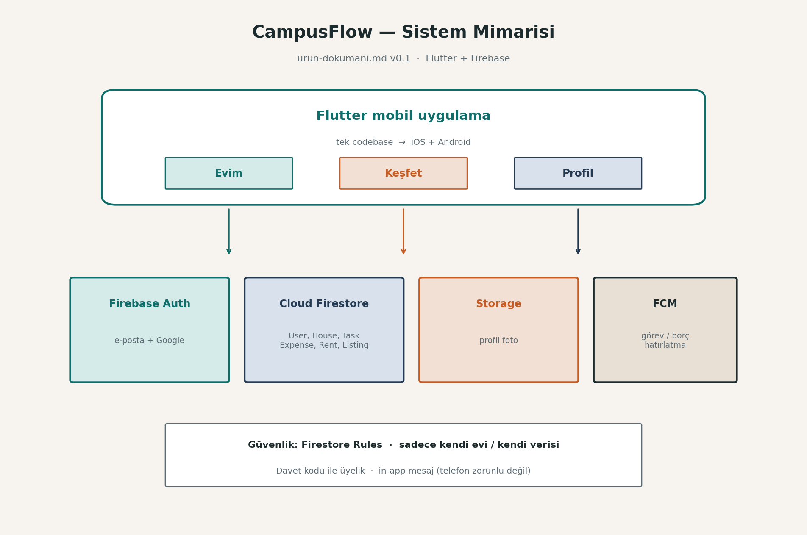
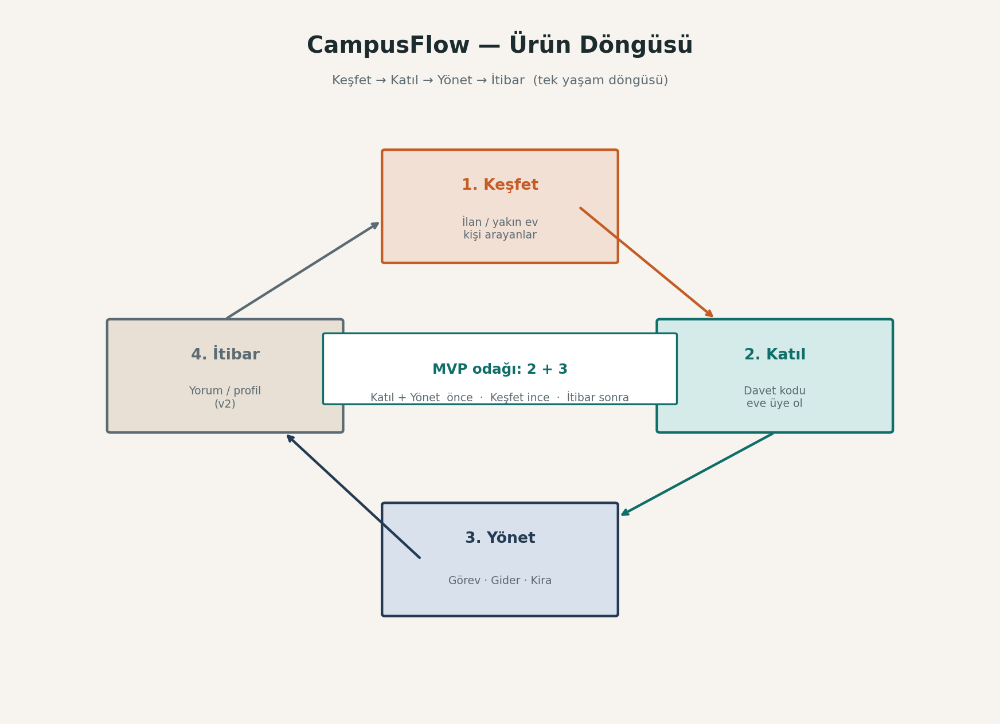
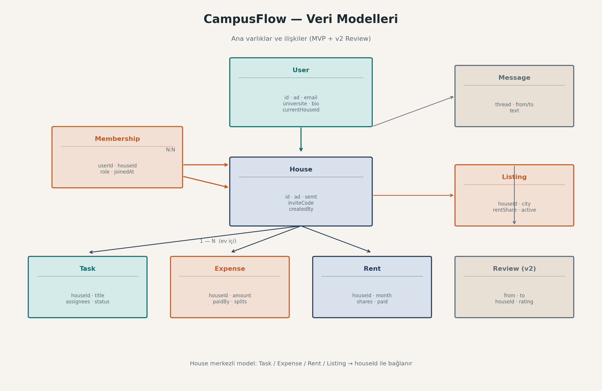
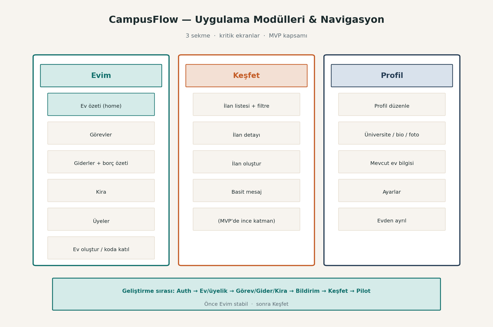
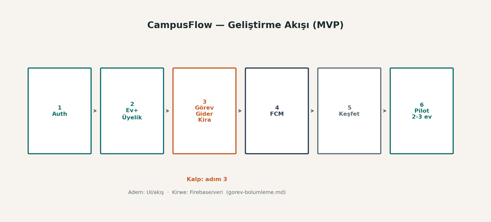

# CampusFlow — Sistem Diyagramları

**Dayanak:** `urun-dokumani.md` v0.1  
**Tarih:** Temmuz 2026  
**Amaç:** Sistemi görsel olarak pekiştirmek (Adem + Kirwe)

PNG kaynaklar: `docs/diagrams/`

---

## 1. Sistem mimarisi

Flutter istemci; Firebase Auth, Firestore, Storage ve FCM servisleri.

---

## 2. Ürün döngüsü

Keşfet → Katıl → Yönet → İtibar. MVP odağı: Katıl + Yönet.

---

## 3. Veri modelleri

House merkezli ilişkiler; Review v2.

---

## 4. Modüller ve navigasyon

Üç sekme: Evim · Keşfet · Profil.

---

## 5. Geliştirme akışı

Auth → Ev → Görev/Gider/Kira → FCM → Keşfet → Pilot.

---

*Görseller `urun-dokumani.md` v0.1 ile uyumludur. Karar değişince diyagramlar güncellenir.*
